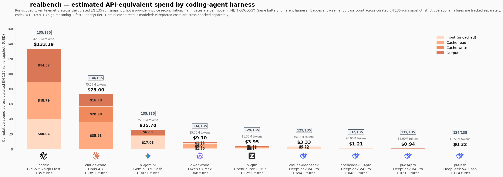
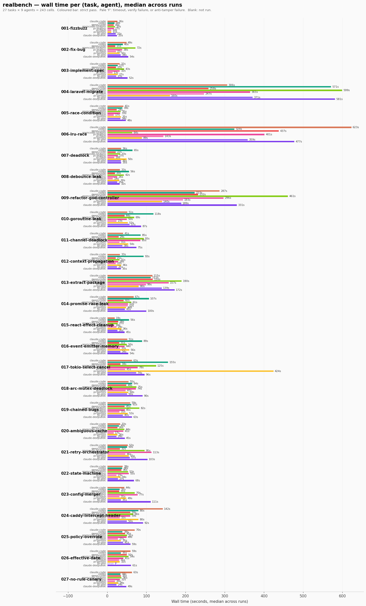

# realbench

**A practical, end-to-end benchmark for coding-agent harnesses.**

Tested on macOS 26.2 / Apple M2 Max. Linux and WSL validation welcome.

Stop ranking only models. Rank the loop. Price the loop.
A different world appears.

On the same DeepSeek V4 Pro primary backend, three coding-agent harnesses
land different run-scoped spend estimates on the 27-task battery run 5 times: **$3.33**,
**$1.21**, and **$0.94**. Same backend target. Same tasks. Same verifier.
Different loop.

At the extreme, Codex with GPT-5.5 and Pi with DeepSeek V4 Flash both
land **134/135** strict runs. One charts at **$133.39** under
API-equivalent pricing. The other charts at **$0.32**. Same verifier,
roughly **420×** less spend.

That 420× figure is for the pinned Codex `xhigh+fast` configuration used
in this snapshot. If you rerun Codex at `medium+auto`, the spread should
compress materially, roughly to the ~80× range; that would be a different
Codex configuration and should be charted as such.

That is the point of realbench: the model matters, but the harness,
prompt loop, tool policy, retries, cache behavior, and termination
discipline decide what you actually get for your money. Cost-weight the
result, and the practical leaderboard changes.





> **TL;DR.** The published snapshot is normalized to
> **9 public harnesses × 27 tasks × 5 English-prompt runs = 1215 runs**.
> The comparable input is [`results/runs-en-135.jsonl`](results/runs-en-135.jsonl);
> [`results/runs.jsonl`](results/runs.jsonl) is the same curated snapshot kept
> at the default path used by the scripts.
>
> Strict pass counts on the 135-run slice:
>
> | Harness | Strict runs | Telemetry cost |
> | --- | ---: | ---: |
> | codex / GPT-5.5 xhigh+fast | 134/135 | $133.39 |
> | claude-code / Opus 4.7 | 133/135 | $73.00 |
> | pi-gemini / Gemini 3.5 Flash | 134/135 | $25.70 |
> | qwen-code / Qwen3.7 Max | 134/135 | $9.10 |
> | pi-glm / OpenRouter GLM 5.1 | 129/135 | $3.95 |
> | claude-deepseek / DeepSeek V4 Pro | 128/135 | $3.33 |
> | opencode-DS4pro / DeepSeek V4 Pro | 132/135 | $1.21 |
> | pi-ds4pro / DeepSeek V4 Pro | 131/135 | $0.94 |
> | pi-flash / DeepSeek V4 Flash | 134/135 | $0.32 |
>
> On strict correctness, the top four rows are effectively tied within
> run-to-run variance: each is 133-134/135. The ranking becomes interesting
> on cost, wall time, and operational failures, not on "can it ever solve the
> task?"
>
> Estimated spend spread on the comparable snapshot is therefore roughly **420×**
> between codex and Pi with DeepSeek V4 Flash. The striking result is not
> just "cheap model vs expensive model": on the same DeepSeek V4 Pro primary backend,
> `claude-deepseek` costs $3.33, `opencode-DS4pro` costs $1.21, and
> `pi-ds4pro` costs $0.94. Harness shape still changes run-scoped spend materially,
> especially once turn counts and prompt-cache behaviour are included.
>
> Cost numbers are **not provider-invoice reconciliations**. They are
> run-scoped estimates from native token telemetry and the rates documented in
> METHODOLOGY. Provider invoices may include exploratory runs, failed
> integrations, retries outside the curated snapshot, and billing details not
> exposed per run.
>
> Failures are concentrated, not random. The strongest canaries in this
> snapshot are `006-lru-race`, `026-effective-date`, and anti-tamper hash
> trips. Several failures are strict harness timeouts where the produced
> workspace still passed `verify.sh`; they are kept as strict failures
> because a non-terminating agent run is still an operational failure.
>
> Regenerate the comparable snapshot and charts with:
>
> ```bash
> .venv/bin/python scripts/curate-en-135.py
> .venv/bin/python scripts/make-same-backend-summary.py
> .venv/bin/python scripts/check-cost-reconciliation.py
> REALBENCH_RUNS=results/runs-en-135.jsonl .venv/bin/python scripts/make-comparison.py
> REALBENCH_RUNS=results/runs-en-135.jsonl REALBENCH_COST_SCOPE_LABEL='curated EN 135-run snapshot' REALBENCH_COST_ONLY_AGENTS_WITH_RUNS=1 .venv/bin/python scripts/make-cost-chart.py
> ```
> [`METHODOLOGY.md`](METHODOLOGY.md) documents the exact protocol,
> pricing sources, and reproduction steps;
> [`FAQ.md`](FAQ.md) answers the obvious criticisms.

Compare Claude Code, Codex, DeepSeek-piloted Claude, Qwen Code, OpenCode,
and Pi CLI variants on DeepSeek, Gemini, and GLM on the same tasks. Capture
success rate, wall time, tokens, and cost — measured natively, from each
harness's own JSON output.

No LLM judge. Each task ships with a deterministic `verify.sh` that exits 0
on success.

---

## Why this exists

Existing benchmarks compare **models**. You install **harnesses**.

A coding-agent CLI is a model **plus a harness**: the planning loop, the
tool catalog, retry logic, prompt caching, sub-agent dispatch, file
I/O conventions, sandboxing. `claude-code`, `codex`, `aider`,
`cursor`, `OpenHands` — same model behind, the harness changes
everything. Two CLIs with the same backend can land very different
results on the same task.

SWE-bench, HumanEval, MBPP measure raw model capability inside a
researcher-crafted harness. That's the right tool for "is GPT-5 better
than Sonnet at coding in the abstract?". It's the wrong tool for
"which harness should I install today for my Laravel migration?".

realbench answers the second question. You run the actual harness, in
its actual configuration, on tasks that look like what you do. You get
back a `runs.jsonl` you can grep, plot, or paste into a spreadsheet.

It's also forkable in 30 seconds. If our 27 tasks aren't yours, write
your own. The contract is five files per task.

---

## What you get

A matrix of runs. `python3 analyze.py` aggregates `results/runs.jsonl`
into a markdown table, one line per `(agent, task)` cell, with success
rate, median wall time, median input/output tokens, and counts of
non-zero exits or timeouts. Example shape (excerpt, 9 public agents × 27 tasks
matrix):

```
| agent           | task                        | success | median wall (s) | ...
| --------------- | --------------------------- | ------- | --------------- |
| claude-code     | 010-goroutine-leak          | 1/1     | 36.8            | ...
| codex           | 010-goroutine-leak          | 1/1     | 496.3           | ...
| qwen-code       | 010-goroutine-leak          | 1/1     | 25.3            | ...
| ...
```

Per-run raw records live in `results/runs.jsonl` (one JSON line per run,
with native metrics: tokens, num_turns, model, cost). In the public
snapshot, `results/runs.jsonl` and `results/runs-en-135.jsonl` both contain
the same comparable publication slice: exactly five English-prompt records
per public `(agent, task)` cell. Re-run with `--runs 5` to get a stable
median and variance for your own fork.

### Reading pass counts

The wall-time matrix and the badge above each cost bar are normalized to the
current **27-task × 5-run** battery, so every public harness has a denominator
of 135. The public repository intentionally ships a curated snapshot rather
than the private iterative run log, so every public harness has exactly 135
records in both result files.

The cost-chart badge reports **strict pass count** across those 135 records:
`success=true` only. A run that times out after producing a workspace that
passes `verify.sh` is still a strict failure, because the harness did not
complete cleanly.

| Agent | Task | What failed strictly | Interpretation |
| --- | --- | --- | --- |
| `claude-code` / Opus 4.7 | `009-refactor-god-controller` | Agent timeout, but `verify.sh` passed. | Operational timeout; counted as strict failure, not solution failure. |
| `claude-code`, `qwen-code`, `opencode`, `pi-ds4pro`, `pi-glm`, `claude-deepseek` | `026-effective-date` | Some runs omitted `R-026-008` from `applicable_rules`; expected `["R-026-005", "R-026-008"]`. | Correct prose/verdict is not enough; scored JSON must identify the operative transition rule. |
| `codex` / GPT-5.5 | `018-arc-mutex-deadlock` | `.test_hash` caught a test-file modification (`verify_exit_code=2`). | Anti-tamper failure; counted as strict failure. |
| `opencode`, `pi-ds4pro`, `pi-gemini`, `pi-glm`, `claude-deepseek` | `006-lru-race` | Logic failures and/or strict timeouts despite nearby successful runs. | Observed instability on the concurrency canary. |
| `pi-flash` | `004-laravel-migrate` | Laravel migration verifier failed. | One strict miss on the high-blast-radius PHP task. |
| `pi-ds4pro` | `025-policy-override` | `answer.json` included an extra non-operative rule. | Non-code rule-set precision failure. |

## Known signals

A few patterns we've seen across the 135-run snapshot (these are observations, not
endorsements — re-run for yourself with `python3 runner.py --runs 5`):

- **Same backend target, different harness — the spend estimate changes.** On DeepSeek V4 Pro,
  `pi-ds4pro` costs **$0.94**, `opencode-DS4pro` costs **$1.21**, and
  `claude-deepseek` costs **$3.33** over the same 135-run slice. The
  model is not enough to predict run-scoped spend; prompt shape, tool schema,
  cache behavior, and agent loop design matter.

  | Harness | Total cost, 135 runs | Median per-task spend (sum of 5 runs), across the 27 tasks | Std-dev of per-task spend across the 27 tasks | Paired note |
  | --- | ---: | ---: | ---: | --- |
  | `claude-deepseek` | $3.33 | $0.110 | $0.036 | More expensive than `pi-ds4pro` on 27/27 tasks |
  | `opencode-DS4pro` | $1.21 | $0.032 | $0.037 | More expensive than `pi-ds4pro` on 21/27 tasks |
  | `pi-ds4pro` | $0.94 | $0.023 | $0.034 | Cheapest total on the shared DeepSeek V4 Pro target |

  Directional, not a formal significance test: N=5 runs per task. Reproduce
  this table with `python3 scripts/make-same-backend-summary.py`.

- **Reasoning-tier choice swings codex cost.** codex pinned to
  GPT-5.5 + `xhigh` reasoning + `fast` (Priority) tier costs **$133.39**
  over the 135-run snapshot. We report this quality-oriented interactive
  config because it is the one used in this snapshot; lower effort or
  standard tier would be cheaper, but it would be a different run.
  See METHODOLOGY §5.
- **The new signal is stability, not just first-pass correctness.** Several
  agents can pass all 27 tasks at least once, but reruns expose
  instability on `026-effective-date`, `006-lru-race`, and
  `025-policy-override`. The cost-chart badge therefore counts the 135
  observed attempts, not "eventually passed once" tasks.
- **`.test_hash` anti-tamper still matters.** Codex triggered a hash
  mismatch on `018-arc-mutex-deadlock` in this snapshot. Without
  anti-tamper that class of failure can look like a normal success.
- **`026-effective-date` is the current non-code discriminator.** It catches
  agents that reach the right prose verdict but omit a required applicable
  rule from `answer.json`. `006-lru-race` still catches strict timeouts or
  logic misses on some harnesses, and `017-tokio-select-cancel` remains the
  anti-tamper canary for codex.
- **Reported `total_cost_usd` is wrong for proxied Claude harnesses.**
  `claude-deepseek` reports cost using Anthropic Opus rates, even though
  the backend is DeepSeek. Its real cost is computed in the chart by
  re-applying DeepSeek's per-token rate to the same token counts.
- **Ambiguous-spec tasks don't elicit design divergence.** On four
  tasks where the spec deliberately accepts multiple valid designs
  (cache eviction, retry policy, state-machine representation, config
  merge semantics), agents repeatedly picked the
  most canonical Python pattern. No Strategy
  class-per-state, no circuit breaker, no FIFO eviction was ever
  attempted. Modern LLMs strongly favor the modal answer for a domain,
  even when prompted to diverge.

---

## Quickstart

```bash
git clone https://github.com/<you>/realbench
cd realbench

# Install whichever CLIs you want to bench (must be on your PATH and
# already authenticated). Today realbench ships wrappers for:
#   - claude-code      (Anthropic, https://claude.com/code)
#   - codex            (OpenAI, https://github.com/openai/codex)
#   - qwen-code        (Alibaba, https://github.com/QwenLM/qwen-code)
#   - claude-deepseek  (claude-code harness, DeepSeek backend)
#   - opencode         (DeepSeek V4 Pro)
#   - pi-ds4pro        (Pi CLI + DeepSeek V4 Pro)
#   - pi-flash         (DeepSeek V4 Flash)
#   - pi-gemini        (Gemini 3.5 Flash)
#   - pi-glm           (GLM 5.1 via OpenRouter)

# Sanity-check setup
python3 runner.py --dry-run

# Run the whole matrix, twice each
python3 runner.py --runs 2

# Or pick a subset
python3 runner.py --agents claude-code,codex --tasks 001,005,009 --runs 3

# Pretty-print the results
python3 analyze.py
```

Per-run raw outputs land in `results/raw/<run_id>/`. The post-run
workspace (whatever the CLI ended up writing) lives in
`results/workspaces/<run_id>/` — nothing is auto-deleted, you can `cd`
in and see exactly what was changed.

### Toolchains expected on PATH per task family

| Tasks | Needs |
| --- | --- |
| 001, 002, 003, 005 | Python ≥ 3.10, `pytest` |
| 004, 009 | PHP ≥ 8.2 (tested 8.5), Composer ≥ 2, sqlite3 |
| 006, 008 | Python ≥ 3.10, `pytest` |
| 007 | Python ≥ 3.10, `pytest` |
| 010-013 | Go ≥ 1.23 (tested 1.26) |
| 014-016 | Node ≥ 20 (tested 25), npm |
| 017-018 | Rust ≥ 1.80 stable (tested 1.94), cargo |
| 024 | Go ≥ 1.23, plus `git` and network access (shallow clone of caddyserver/caddy at a pinned SHA) |
| 025-027 | Python ≥ 3.10 only (`verify.sh` compares `answer.json`) |

First run per task family triggers a package download (Composer / Go
modules / npm / cargo). Subsequent runs use the toolchain's global
cache. Each `verify.sh` exits 127 with a clear message if its
toolchain isn't found.

---

## How it works

```
                   ┌────────────────────┐
                   │  runner.py         │
                   │  ─────────────     │
                   │  for each          │
                   │  (agent,task,run): │
                   └─────────┬──────────┘
                             │
       ┌─────────────────────┼─────────────────────┐
       │                     │                     │
       ▼                     ▼                     ▼
 copy task workspace    invoke wrapper       run verify.sh
 to results/...         agents/<name>.sh     deterministic exit code
                        prompt_file, raw_dir
                             │
                             ▼
                   capture native JSON,
                   append a JSON line to
                   results/runs.jsonl
```

Three components:

- **`agents/<name>.sh`** — a 20-line bash wrapper per CLI. Receives a
  prompt path and a raw-output directory; writes `stdout.txt`,
  `stderr.txt`, and optionally `native.json`/`native.jsonl`. Returns the
  CLI's exit code. Must auto-approve all tool calls.

- **`tasks/<id>-<slug>/`** — five files: `prompt.md`, `workspace/`
  (initial state), `_reference/` (a known-good solution), `verify.sh`
  (deterministic), and `.test_hash` (sha256 anti-tamper on the test
  files).

- **`runner.py`** — copies the workspace per run, invokes the wrapper,
  invokes the verify, parses native metrics best-effort, appends to
  `results/runs.jsonl`. Robust to timeouts and crashes.

---

## Tasks included

| ID | What it tests | Difficulty |
| --- | --- | --- |
| 001-fizzbuzz | Smoke test. Implement a function from tests. | trivial |
| 002-fix-bug | Diagnose a `weighted_average` bug (multi-file Python) | low |
| 003-implement-spec | Implement a thread-safe `TTLCache` from a pytest suite | mid |
| 004-laravel-migrate | Migrate a ~56-file Laravel 8 mini-app to Laravel 12 | high |
| 005-race-condition | Fix an oversell race in `Inventory.reserve()` | mid |
| 006-lru-race | Fix a non-trivial LRU cache race (3 failure modes) | mid+ |
| 007-deadlock | Naive lock ordering causes deadlock; needs ordered locks | mid+ |
| 008-debounce-leak | Debouncer leaks callbacks; canceling the prior Timer is the key | mid |
| 009-refactor-god-controller | Refactor a Laravel `OrderController` into Services + FormRequest + Resource; verified by 7 Feature tests + 9 Architecture tests (ReflectionClass, brace-matching, regex on imports) | high |
| 010-goroutine-leak | Worker pool that leaks goroutines when context is cancelled; detected by `go.uber.org/goleak` in `TestMain` | mid |
| 011-channel-deadlock | Unbuffered channel hangs when a worker panics before sending; needs proper recover + WaitGroup-driven close | mid+ |
| 012-context-propagation | HTTP handler ignores `r.Context().Done()` and keeps working after client cancel; verified by side-channel counter | mid |
| 013-extract-package | Refactor a ~250-line Go `main.go` into `domain/`, `storage/`, `httpapi/` packages; 5 Architecture tests via pure `go/ast` (no cyclic imports, layer dependencies, thin main, single canonical type, no external deps in domain) | high |
| 014-promise-race-leak | `Promise.race` over multiple fetchers never aborts the losers; detected by spies on `AbortSignal` over 200×4 stress iterations | mid |
| 015-react-effect-cleanup | Custom `useDebounce` hook leaks `setTimeout` on unmount and on deps change; detected by `jest.getTimerCount() === 0` invariant | mid |
| 016-event-emitter-memory | `EventBus.subscribe()` returns a fake `unsubscribe` (tombstones pattern) that keeps the underlying Set growing; detected by `listenerCount` and 10 000-item stress | mid |
| 017-tokio-select-cancel | `tokio::select!` branch with a CPU-bound loop ignores cancellation, starving other tasks on the same worker; detected by `tokio::spawn` + `tokio::time::timeout` across threads | high |
| 018-arc-mutex-deadlock | Two `Arc<Mutex<T>>` locked in different orders by cross-direction transfers; detected by `mpsc` heartbeat + `std::process::exit(101)` (panic alone does not free `Mutex::lock` waiters) | mid+ |
| 019-chained-bugs | Python ETL with three bugs structurally chained through pytest fixtures: extract → transform → load. Each bug hides the next behind a fixture error, so the agent has to inspect-fix-rerun at least 3 times to surface them all. Stresses multi-turn behavior, not just final correctness. | mid+ |
| 020-ambiguous-cache | Generic cache with a deliberately ambiguous spec: the eviction strategy is up to the agent. Verify accepts any reasonable strategy (LRU, FIFO, random, TTL, ...) via positive invariants + negative structural tests (must do at least one removal op, must document the chosen strategy, no half-thread-safe locking). | mid |
| 021-retry-orchestrator | Retry policy for flaky backend services. The strategy is left open: exponential backoff, jitter, fixed delay, linear, circuit breaker — all five are accepted by the verify. Anti-patterns rejected: infinite retry, sleeping inside a lock, no retry at all, no documented strategy. | mid |
| 022-state-machine | Order workflow state machine with business rules. Internal representation is up to the agent — dict of transitions, Machine class with one method per event, Strategy class-per-state, decorator-based registry: all four pass. Anti-patterns rejected: hardcoded `set_status_to_paid()` setters, business logic in `__setattr__`, silent idempotence, no validation. | mid+ |
| 023-config-merger | Merge a list of nested config dicts with override priority. The semantics for nested values are left open: deep recursive merge, shallow replace, list-concat strategy, strategy-by-param — all four pass. Anti-patterns rejected: mutating the input, file-format coupling (`json`, `yaml` imports), `eval`, module-level globals. | mid |
| 024-caddy-intercept-header | Real-OSS calibration: fetch [caddyserver/caddy](https://github.com/caddyserver/caddy) at the parent SHA of [PR #6429](https://github.com/caddyserver/caddy/pull/6429), reproduce a failing integration test (`{resp.header.*}` placeholders carry the request headers instead of the response's), and ship the same one-line fix the project shipped. The workspace `setup.sh` does the shallow clone; the test file is hash-protected. | mid |
| 025-policy-override | Non-code rule-corpus task. Read a Markdown logistics policy corpus and write `answer.json`; requires applying a night-operation prohibition plus a later emergency utility override. | low+ |
| 026-effective-date | Non-code rule-corpus task. Resolve a stored-value policy scenario where a prior exemption is repealed and a transition window has expired. | mid |
| 027-no-rule-canary | Non-code rule-corpus canary. Many nearby mobility rules exist, but none covers the residential grocery cart scenario; correct output is `NO_RULE` with empty rule sets. | low+ |

The Architecture tests on 009 are worth a closer look: they measure
refactor quality deterministically, no LLM judge needed.

---

## Add a task

Five files. Pattern:

```
tasks/010-your-task/
├── prompt.md            # 3-5 lines, what the agent must do
├── workspace/           # initial state (broken / incomplete)
├── _reference/          # one known-good solution; not seen by the agent
├── verify.sh            # exits 0 iff the solution is correct
└── .test_hash           # sha256 of the test files (anti-tamper)
```

Test it both ways before committing:

```bash
# verify.sh on initial workspace MUST fail
bash tasks/010-your-task/verify.sh; echo "expected non-zero, got $?"

# verify.sh after dropping _reference on workspace MUST pass
# (drop _reference/* over a copy of workspace/, then run verify.sh)
```

Then add the task ID to `DEFAULT_TASKS` in `runner.py`.

---

## Add an agent

A bash script. Pattern:

```bash
#!/usr/bin/env bash
# Wrapper for <your CLI>.
# Usage: <name>.sh <prompt_file> <raw_dir>
# cwd is positioned by the runner on the task workspace.
set -u
prompt_file="$1"; raw_dir="$2"
mkdir -p "$raw_dir"
prompt="$(cat "$prompt_file")"

<your-cli-here> --non-interactive --auto-approve "$prompt" \
  > "$raw_dir/stdout.txt" 2> "$raw_dir/stderr.txt"
rc=$?

# If your CLI emits structured JSON, copy/rename to native.json or .jsonl
# so analyze.py can pick it up.
exit $rc
```

Then add the agent name to `DEFAULT_AGENTS` in `runner.py` and write a
small parser in `PARSERS` if you want native metrics in the analyze table.

Examples in this repo:

- `agents/claude-deepseek.sh` — sources `~/deepseek/.deepseek-env`
  before calling `claude -p`, so the same Claude Code harness runs
  against a DeepSeek backend. Useful for "same harness, different
  model" comparisons.
- `agents/qwen-code.sh` — wraps the official Qwen Code CLI (DashScope
  provider). Requires `~/qwen/.qwen-env` with `OPENAI_API_KEY`,
  `OPENAI_BASE_URL`, `OPENAI_MODEL` set for DashScope's
  OpenAI-compatible endpoint.
- `agents/opencode.sh`, `agents/pi-ds4pro.sh`, `agents/pi-flash.sh`, and
  `agents/pi-gemini.sh` — same battery through lightweight third-party
  harnesses and different model backends.
- `agents/pi-glm.sh` — Pi on `z-ai/glm-5.1` through OpenRouter. It is
  included in the comparable 135-run snapshot.

---

## Design principles

The public snapshot keeps the design rationale in this README, the FAQ,
and `METHODOLOGY.md` instead of shipping a construction diary. The core
principles are:

- Run each CLI as shipped; no uniform proxy.
- One small bash wrapper per agent.
- Deterministic `verify.sh`; no LLM judge.
- Hash-protect verifier files against tampering.
- Keep task workspaces small enough to run locally and inspect.
- Preserve native metrics, but do not pretend they are uniform across CLIs.
- Use the curated 135-run EN snapshot for public charts; keep raw runs as
  an audit artifact.

---

## Known biases

The 27 tasks still lean heavily towards **backend webdev**: Python,
PHP/Laravel, Go, TypeScript/Node, Rust. Tasks 025-027 add a small
non-code rule-corpus slice, but they do not turn realbench into a legal,
compliance, or general reasoning benchmark. Five families are deliberately
absent for now — a CLI that excels here doesn't automatically excel there:

- **SQL & data warehouse** — no PostgreSQL/Snowflake DDL, no query
  optimization, no schema migration with backfills.
- **Data science & ML** — no Pandas/NumPy/sklearn workflows, no
  notebook tasks, no model training/eval loops.
- **DevOps & IaC** — no Terraform/Pulumi, no Kubernetes manifests, no
  CI/CD pipeline editing, no Docker Compose orchestration.
- **Frontend visual** — no CSS layout, no responsive design, no
  accessibility, no shaders or graphics.
- **Mobile & embedded** — no Swift/Kotlin/Flutter, no
  bare-metal/embedded C.
- **Sysadmin** — no complex bash scripting, no log parsing, no system
  tuning.

If your daily workflow is heavily in one of those families, the bench's
signal about which CLI to pick may not transfer. PRs adding tasks in
these areas are welcome.

## Limitations

Honest list:

- **Small N by default.** 27 tasks. SWE-bench Lite has ~300. realbench
  is a tool for personal decisions, not statistical claims. Run with
  `--runs 5+` to get useful variance.
- **Fabricated tasks.** Tasks 004 and 009 are mini-projects, not real
  OSS codebases. Capable agents that pass them might still bog down on a
  real 500-file Laravel project with custom packages.
- **`total_cost_usd` is wrong for `claude-deepseek`.** Claude Code
  computes cost using Anthropic Opus rates, ignoring that the proxy
  redirects to DeepSeek. The chart recomputes that row from token counts
  and DeepSeek public pricing.
- **The cost chart is not an invoice reconciliation.** It is run-scoped
  telemetry multiplied by documented rates. Gemini is the clearest example:
  `pi-gemini` reports per-run costs for 134/135 rows, but a provider invoice
  can include calls outside this curated snapshot and will not necessarily
  match the chart total.
- **Native metrics aren't comparable across CLIs.** Claude reports `12`
  input tokens (cache excluded) where Codex reports `80k` on the same
  task (everything aggregated). Read each agent's column on its own
  terms.
- **Prompts are fixed, not per-harness optimized.** A harness may need a
  different style of prompt to show its best behavior. We keep one task
  prompt per task so the matrix measures the shipped agent+harness under
  the same contract, not a separate prompt-tuning exercise.
- **Synthetic wording can trip provider filters.** An early draft of
  `025-policy-override` used a fictional medical delivery scenario
  (`biological sample`, `hospital incident`) and Claude Code refused it
  under safety policy. The published task uses neutral utility-logistics
  wording because this bench should not measure safety-filter behavior
  unless a task is explicitly designed for that.
- **Anti-tamper is partial.** `.test_hash` covers test files; it
  doesn't cover `phpunit.xml`, `conftest.py`, or fixture data. A
  motivated cheating agent could disable a suite via config. We haven't
  seen it; if you do, file an issue.
- **For rigorous model comparison, use SWE-bench Verified instead.**
  realbench is for tool-level decisions, not model leaderboards.

---

## Contributing

Issues and PRs welcome. The bar for a new task is:

1. `verify.sh` is deterministic (5/5 runs same exit code on a given
   state).
2. Initial workspace fails verify; `_reference/` passes it.
3. The task tests *something*, ideally something existing tasks don't.

For new agents: a wrapper that runs the CLI non-interactively with
auto-approval, plus a parser in `runner.py` if the CLI emits structured
output.

---

## License

[MIT](LICENSE).
